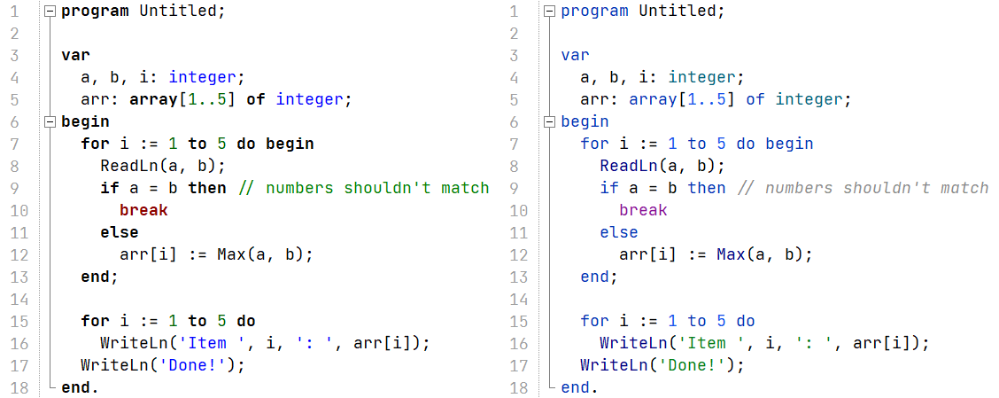

# PascalABC.NET Color Scheme
Color scheme for PascalABC.NET based on JetBrains' IntelliJ Light
## Preview:

(font used: JetBrains Mono)
## Installation:
* Go to the PascalABC.NET installation folder (`C:\Program Files (x86)\PascalABC.NET\` by default)
* Go to the `\Highlighting\`
* Replace `PascalABCNET.xshd` with one from this repository
